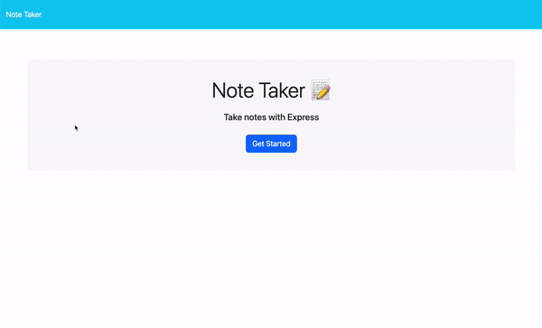

# Digital Notebook 📝

## Table of Contents

* [Description](#description)
* [Installation](#installation)
* [Usage](#usage)
* [Credits](#credits)
* [Technologies Used](#technologies-used)
* [License](#license)

## Description
The Digital Notebook is a note-taking app allowing users to save notes to a database. Utilization of Express.js enables the app to access note data from a JSON database file. This allows user's data to persist beyond ended sessions in the browser.

Future development for this app could include the implementation of categories/folders for notes to allow users organization of notes.

> [Clone the repository](https://github.com/eepitsporsche/digital_notebook) to your machine to operate the application via VS Code.

## Installation
Access the Digital Notebook via this [Heroku](https://digital-notebook-b0f47115d953.herokuapp.com/) link.

## Usage
Users can enter the note-taking interface by clicking the "Get Started" button on the homepage. Users may enter respective information in the "Note Title" and "Note Text" fields and click the "Save Note" button to store the note in the app.

If a user determines the data they are entering is in error, they may use the "Clear Form" button to erase unsaved data in the form.

Text entered in the "Note Title" field will appear in the left column on the page, wherein the user may click the item to regenerate the associated note data.

Saved notes can be deleted from the app by clicking the trash icon to the right of the note to be removed.

## Credits
* [Stack Overflow](https://stackoverflow.com/questions/70700607/how-to-add-a-unique-id-to-each-entry-in-my-json-object) was used for information on creating unique IDs for JSON objects.
* [Stack Overflow](https://stackoverflow.com/questions/62706358/how-to-remove-an-object-from-a-json-file) was used for information on removing an object from a JSON file.
* [Log Rocket](https://blog.logrocket.com/reading-writing-json-files-node-js-complete-tutorial/) was used for information on reading and writing to JSON files.
* [Geeks for Geeks](https://www.geeksforgeeks.org/how-to-add-data-in-json-file-using-node-js/) was used  for information on adding to JSON files using the <code>push()</code> method.
* UCB Bootcamp Instructor: [Robbert Wijtman](https://github.com/Bucky24)
* UCB Bootcamp provided front-end HTML and CSS for this project.

## Technologies Used
* VS Code
* Node.js
* [Express.js](https://www.npmjs.com/package/express)
* [UUID V4](https://www.npmjs.com/package/uuidv4)
* [Heroku](https://www.heroku.com/home)

## License
<a href="https://opensource.org/licenses/MIT">MIT License</a>

Copyright© 2024 Porsche Herskorn

Permission is hereby granted, free of charge, to any person obtaining a copy of this software and associated documentation files (the "Software"), to deal in the Software without restriction, including without limitation the rights to use, copy, modify, merge, publish, distribute, sublicense, and/or sell copies of the Software, and to permit persons to whom the Software is furnished to do so, subject to the following conditions:

The above copyright notice and this permission notice shall be included in all copies or substantial portions of the Software.

THE SOFTWARE IS PROVIDED "AS IS", WITHOUT WARRANTY OF ANY KIND, EXPRESS OR IMPLIED, INCLUDING BUT NOT LIMITED TO THE WARRANTIES OF MERCHANTABILITY, FITNESS FOR A PARTICULAR PURPOSE AND NONINFRINGEMENT. IN NO EVENT SHALL THE AUTHORS OR COPYRIGHT HOLDERS BE LIABLE FOR ANY CLAIM, DAMAGES OR OTHER LIABILITY, WHETHER IN AN ACTION OF CONTRACT, TORT OR OTHERWISE, ARISING FROM, OUT OF OR IN CONNECTION WITH THE SOFTWARE OR THE USE OR OTHER DEALINGS IN THE SOFTWARE.

### 
[Back to Top](#digital-notebook-📝)
